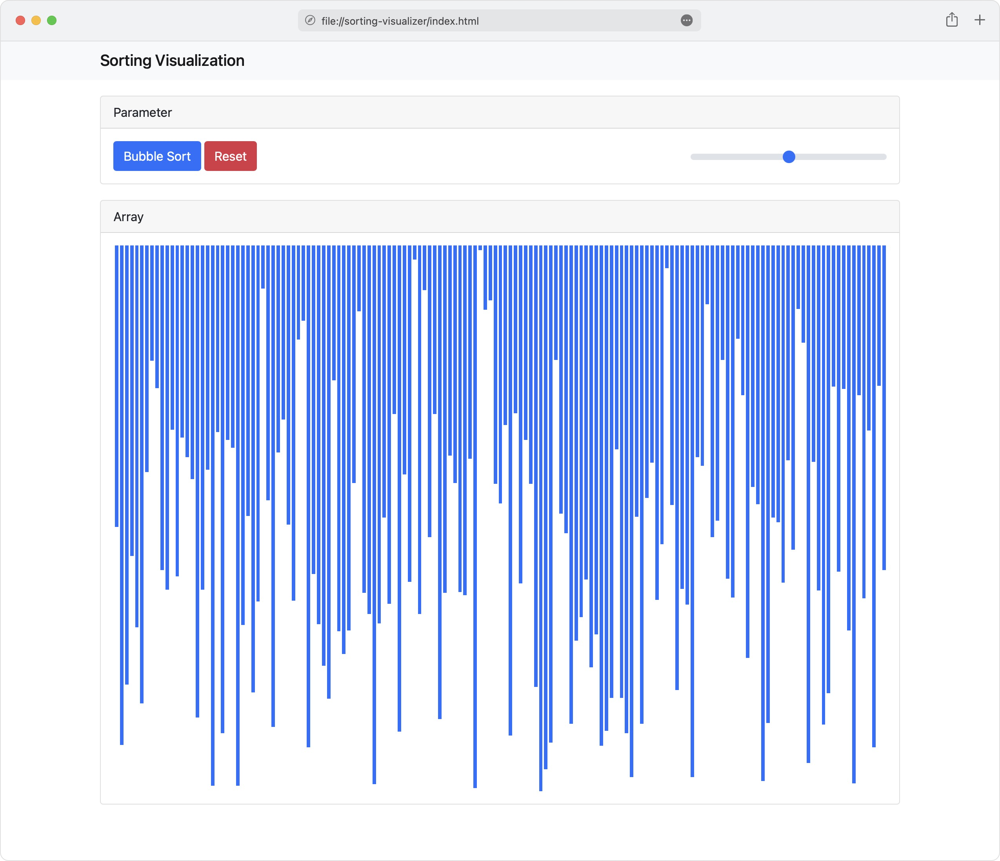

# Sorting Visualization

## Description
This application will show you a sortable array as a graphic in your web browser.  
The graphic is created using colored div elements, therefore it is really easy for you to change the appearance. 

The goal of this project is to provide boilerplate code, so you can start to program your own sorting algorithms and visualize them.

## Technologies
This Project uses HTML, JavaScript and CSS only.  
For the navbar, cards and input elements Bootstrap is used.

## Preview
